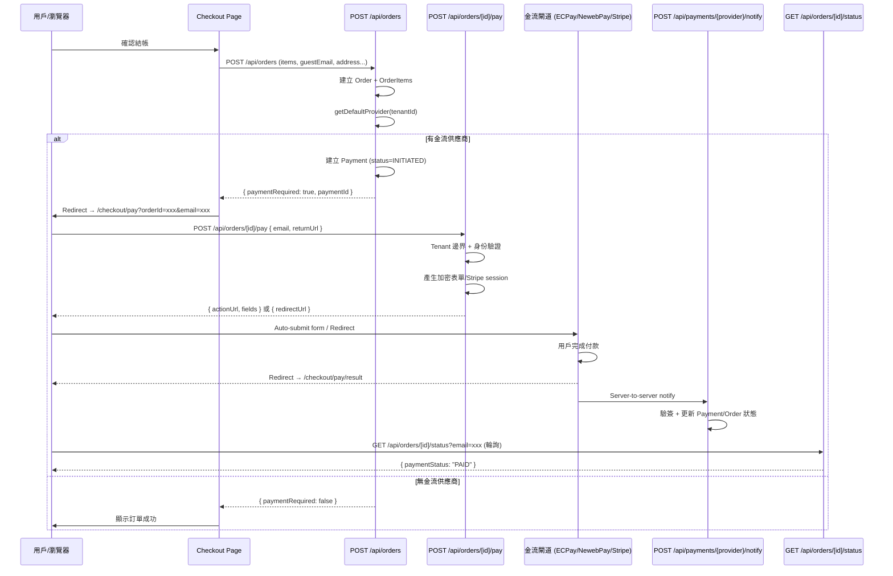
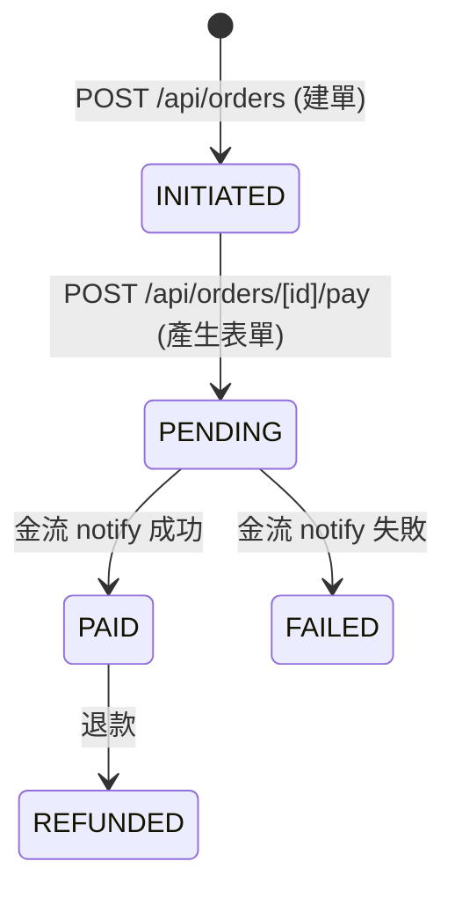

# 動態金流付款架構

> **狀態**: 已實作 ✅  
> **日期**: 2026-02-10  
> **版本**: 1.0  
> **作者**: System (Inferred from code)

## 目錄

- [1 設計目標](#1-設計目標)
- [2 架構概覽](#2-架構概覽)
- [3 付款流程](#3-付款流程)
  - [3.1 完整流程圖](#31-完整流程圖)
  - [3.2 步驟說明](#32-步驟說明)
- [4 安全策略](#4-安全策略)
  - [4.1 Tenant 邊界驗證](#41-tenant-邊界驗證)
  - [4.2 身份驗證](#42-身份驗證)
- [5 金流供應商](#5-金流供應商)
  - [5.1 支援的供應商](#51-支援的供應商)
  - [5.2 供應商配置](#52-供應商配置)
  - [5.3 動態選擇邏輯](#53-動態選擇邏輯)
- [6 API 端點](#6-api-端點)
- [7 前端頁面](#7-前端頁面)
- [8 資料模型](#8-資料模型)
- [9 相關檔案](#9-相關檔案)
- [10 測試覆蓋](#10-測試覆蓋)

---

## 1 設計目標

1. **動態供應商選擇**：根據 tenant 的 `payment_providers` 配置，自動選用預設金流供應商
2. **訪客結帳支援**：未登入用戶可透過 email 驗證身份完成付款
3. **安全隔離**：所有付款端點強制 tenant 邊界 + 身份驗證，防止跨租戶存取
4. **結構化表單資料**：金流閘道表單以 `{ actionUrl, fields }` 回傳，避免 XSS（不回傳 raw HTML）
5. **無金流亦可運作**：若 tenant 未設定金流供應商，訂單建立成功但不進入付款流程（`paymentRequired: false`）

---

## 2 架構概覽

```
┌─────────────────────────────────────────────────────────┐
│                      Frontend                            │
│  checkout/page.tsx → checkout/pay/page.tsx               │
│                       → checkout/pay/result/page.tsx     │
└──────────┬─────────────────┬─────────────────┬──────────┘
           │ POST            │ POST            │ GET
           ▼                 ▼                 ▼
   /api/orders         /api/orders/     /api/orders/
   (建單+檢查provider)  [id]/pay         [id]/status
           │            (產生表單)       (輪詢狀態)
           │                 │
           ▼                 ▼
   payment_providers    lib/payment/
   (DB: 供應商配置)     ├── index.ts (getDefaultProvider)
                        ├── newebpay.ts (createFormData)
                        ├── ecpay.ts (createFormData)
                        └── stripe.ts (createCheckoutSession)
```

---

## 3 付款流程

### 3.1 完整流程圖



### 3.2 步驟說明

| 步驟 | 端點 | 說明 |
|:---|:---|:---|
| 1. 建立訂單 | `POST /api/orders` | 驗證商品、庫存、計算金額；查 `getDefaultProvider(tenantId)` |
| 2. 建立 Payment | 同上 | 若有 provider → 建 `Payment(status=INITIATED)`；回傳 `paymentRequired: true` |
| 3. 導向付款頁 | Frontend redirect | `/checkout/pay?orderId=xxx&email=xxx` |
| 4. 產生表單 | `POST /api/orders/[id]/pay` | 驗證身份 → 呼叫 `createFormData()` → 回傳結構化表單 |
| 5. 自動提交 | Frontend auto-submit | 用 hidden form 自動 POST 到閘道，或 Stripe redirect |
| 6. 閘道回調 | `POST /api/payments/{provider}/notify` | 驗簽、更新 `Payment.status` 和 `Order.paymentStatus` |
| 7. 結果輪詢 | `GET /api/orders/[id]/status?email=xxx` | 前端每 2 秒輪詢，最多 10 次 |

---

## 4 安全策略

### 4.1 Tenant 邊界驗證

**所有付款相關端點**都使用 `resolveTenantFromRequest(request)` 從 request host 解析 tenant，並將 `tenantId` 作為查詢條件：

```typescript
// 使用 findFirst 而非 findUnique，加上 tenantId 過濾
const order = await db.order.findFirst({
  where: { id: orderId, tenantId: tenant.tenantId },
});
```

- **跨租戶存取**：不同 tenant 的訂單 ID 即使被猜到，也會因 `tenantId` 不匹配而回傳 404
- **無法解析 tenant**：回傳 400 `TENANT_NOT_FOUND`

### 4.2 身份驗證

| 訂單類型 | 驗證方式 | 失敗回應 |
|:---|:---|:---|
| **登入用戶訂單** (`order.userId` 存在) | `authWithTenant()` 取得 session，`session.user.id === order.userId` | 403 `FORBIDDEN` |
| **訪客訂單** (`metadata.guestEmail` 存在) | 請求中的 `email` 必填且必須與 `metadata.guestEmail` 大小寫不敏感匹配 | 400 `EMAIL_REQUIRED` 或 403 `FORBIDDEN` |
| **無法辨識** (無 userId 也無 guestEmail) | 直接拒絕 | 403 `FORBIDDEN` |

**Pay 端點** (`POST /api/orders/[id]/pay`)：email 從 request body 取得  
**Status 端點** (`GET /api/orders/[id]/status`)：email 從 query param `?email=xxx` 取得

---

## 5 金流供應商

### 5.1 支援的供應商

| 供應商 | 類型 | 付款方式 | 整合模式 |
|:---|:---|:---|:---|
| **ECPay (綠界)** | `ECPAY` | 信用卡、ATM、超商代碼 | Form redirect |
| **NewebPay (藍新)** | `NEWEBPAY` | 信用卡、ATM、Apple Pay、LINE Pay | Form redirect |
| **Stripe** | `STRIPE` | 100+ 種國際付款方式 | Checkout Session redirect |
| **PayPal** | `PAYPAL` | PayPal 帳戶、信用卡 | Webhook notify |

### 5.2 供應商配置

儲存於 `payment_providers` 表的 `config` JSON 欄位：

```json
// ECPay
{ "merchantId": "...", "hashKey": "...", "hashIV": "...", "isProduction": "false" }

// NewebPay
{ "merchantId": "...", "hashKey": "...", "hashIV": "...", "isProduction": "false" }

// Stripe
{ "secretKey": "sk_test_...", "webhookSecret": "whsec_..." }
```

**啟用金流**：在 `payment_providers` 表插入一筆記錄並設 `isDefault = true`：
```bash
npx tsx prisma/seed-payment-provider.ts
```

### 5.3 動態選擇邏輯

```typescript
// lib/payment/index.ts
export async function getDefaultProvider(tenantId: string) {
  return db.paymentProvider.findFirst({
    where: { tenantId, isDefault: true },
  }) ?? db.paymentProvider.findFirst({
    where: { tenantId },
  });
}
```

優先取 `isDefault = true` 的供應商，若無則取第一筆。

---

## 6 API 端點

### POST /api/orders/[id]/pay

產生金流付款表單（或 Stripe redirect URL）。

| 欄位 | 說明 |
|:---|:---|
| **URL** | `POST /api/orders/{orderId}/pay` |
| **認證** | Tenant 邊界 + 身份驗證（見 §4） |
| **Request Body** | `{ email?: string, returnUrl: string }` |
| **成功回應 (form)** | `{ success: true, data: { type: "form_redirect", actionUrl, fields, provider, paymentId } }` |
| **成功回應 (redirect)** | `{ success: true, data: { type: "redirect", redirectUrl, provider, paymentId } }` |
| **錯誤** | 400 `INVALID_INPUT` / `TENANT_NOT_FOUND` / `EMAIL_REQUIRED` / `NO_PROVIDER`<br>403 `FORBIDDEN`<br>404 `NOT_FOUND`<br>409 `ALREADY_PAID` |

### GET /api/orders/[id]/status

輕量狀態查詢（供付款結果頁輪詢）。

| 欄位 | 說明 |
|:---|:---|
| **URL** | `GET /api/orders/{orderId}/status?email=xxx` |
| **認證** | Tenant 邊界 + 身份驗證（見 §4） |
| **成功回應** | `{ success: true, data: { orderId, orderNo, status, paymentStatus } }` |
| **錯誤** | 400 `TENANT_NOT_FOUND`<br>403 `FORBIDDEN`<br>404 `NOT_FOUND` |

---

## 7 前端頁面

| 頁面 | 路徑 | 功能 |
|:---|:---|:---|
| **結帳頁** | `app/(public)/checkout/page.tsx` | 訂單建立；若 `paymentRequired` 則 redirect 到 pay 頁 |
| **付款頁** | `app/(public)/checkout/pay/page.tsx` | 呼叫 `/api/orders/[id]/pay` → 自動提交 form 到閘道 |
| **結果頁** | `app/(public)/checkout/pay/result/page.tsx` | 輪詢 `/api/orders/[id]/status` 顯示付款結果 |

---

## 8 資料模型

### Payment 狀態流轉



### Guest Email 儲存

訪客資訊儲存在 `Order.metadata` JSON 欄位（非獨立欄位）：

```json
{
  "guestEmail": "guest@example.com",
  "guestPhone": "0912345678",
  "guestName": "王小明"
}
```

---

## 9 相關檔案

| 類型 | 路徑 | 說明 |
|:---|:---|:---|
| **API** | `app/api/orders/[id]/pay/route.ts` | 付款表單產生端點 |
| **API** | `app/api/orders/[id]/status/route.ts` | 狀態輪詢端點 |
| **API** | `app/api/orders/route.ts` | 訂單建立（含 `paymentRequired` 邏輯） |
| **API** | `app/api/payments/route.ts` | 舊版付款端點（需登入） |
| **API** | `app/api/payments/{provider}/notify/route.ts` | 金流回調端點 |
| **Lib** | `lib/payment/index.ts` | `getDefaultProvider()`, `PaymentFormData` 型別 |
| **Lib** | `lib/payment/ecpay.ts` | `createFormData()`, `createTransaction()` |
| **Lib** | `lib/payment/newebpay.ts` | `createFormData()`, `createTransaction()` |
| **Lib** | `lib/payment/stripe.ts` | `createCheckoutSession()`, `createPaymentIntent()` |
| **Lib** | `lib/payment/paypal.ts` | PayPal 整合 |
| **Lib** | `lib/tenant/resolve-tenant.ts` | Tenant 解析（hostname → tenantId） |
| **Lib** | `lib/api/auth-helpers.ts` | `authWithTenant()` 認證輔助 |
| **Frontend** | `app/(public)/checkout/pay/page.tsx` | 付款頁（auto-submit form） |
| **Frontend** | `app/(public)/checkout/pay/result/page.tsx` | 結果頁（polling） |
| **Seed** | `prisma/seed-payment-provider.ts` | 供應商種子腳本 |
| **Test** | `tests/api/payment-endpoints.test.ts` | 17 個安全測試 |

---

## 10 測試覆蓋

`tests/api/payment-endpoints.test.ts` — 17 個測試案例：

**POST /api/orders/[id]/pay**:
- ✅ 無法解析 tenant → 400
- ✅ 跨租戶訂單 → 404
- ✅ 訪客缺少 email → 400
- ✅ 訪客 email 不匹配 → 403
- ✅ 登入用戶 userId 不匹配 → 403
- ✅ 未登入嘗試付款登入用戶訂單 → 403
- ✅ 已付款訂單 → 409
- ✅ 無法驗證身份的訂單 → 403

**GET /api/orders/[id]/status**:
- ✅ 無法解析 tenant → 400
- ✅ 跨租戶訂單 → 404
- ✅ 訪客缺少 email → 403
- ✅ 訪客 email 不匹配 → 403
- ✅ 訪客 email 匹配 → 200 成功
- ✅ Email 大小寫不敏感驗證 → 200 成功
- ✅ 登入用戶 userId 不匹配 → 403
- ✅ 登入用戶 userId 匹配 → 200 成功
- ✅ 無法驗證身份的訂單 → 403
